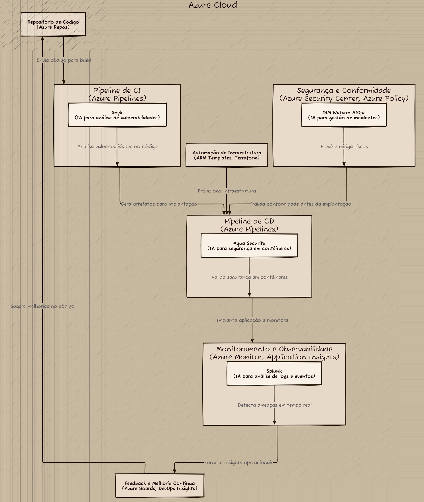

Olá, leitor(a)!  

Este artigo explora a aplicação da Inteligência Artificial (IA) no campo do DevOps, destacando seus benefícios, desafios e ferramentas modernas que suportam operações eficientes. Apresentamos uma arquitetura CI/CD robusta utilizando a Azure como plataforma de nuvem e integramos ferramentas de IA para fortalecer a segurança (DevSecOps). O objetivo é fornecer uma visão prática sobre como a IA pode transformar pipelines de desenvolvimento, automação e monitoramento.


## 1. Introdução

O **DevOps** revolucionou a forma como as organizações entregam software, combinando práticas de desenvolvimento (Development) e operações (Operations) para acelerar ciclos de lançamento e melhorar a qualidade. No entanto, com o aumento da complexidade dos sistemas e a explosão de dados, surgiram novos desafios. A **Inteligência Artificial (IA)** emerge como uma solução poderosa para otimizar processos, prever problemas e automatizar tarefas repetitivas.

O termo **AIOps** (Artificial Intelligence for IT Operations) descreve o uso de IA e machine learning para melhorar as práticas de DevOps. Este artigo explora os benefícios e limitações da IA no DevOps, apresenta ferramentas modernas e propõe uma arquitetura CI/CD integrada à Azure, com foco em segurança (DevSecOps).


## 2. Vantagens da IA no DevOps

A IA oferece várias vantagens significativas para equipes de DevOps:

- **Automação Avançada**: Ferramentas como Jenkins com plugins de IA podem priorizar builds críticos e sugerir otimizações no pipeline.
- **Detecção Proativa de Problemas**: Plataformas como Datadog e Splunk usam algoritmos preditivos para identificar anomalias e prever falhas antes que elas ocorram.
- **Otimização de Recursos**: AWS DevOps Guru e Azure Advisor fornecem recomendações personalizadas para otimização de infraestrutura.
- **Melhoria na Segurança (DevSecOps)**: Ferramentas como Snyk e Aqua Security usam IA para identificar vulnerabilidades em código, dependências e configurações.
- **Gestão de Capacidade e Escalabilidade**: Soluções como Kubernetes Autoscaler e Prometheus ajustam automaticamente a capacidade dos sistemas.
- **Testes Automatizados e Qualidade de Código**: Applitools e Testim.io aplicam machine learning para criar e manter testes automatizados.
- **Assistência em Tempo Real**: IBM Watson AIOps e Microsoft Copilot oferecem suporte em tempo real para resolver problemas rapidamente.


## 3. Desvantagens da IA no DevOps

Apesar dos benefícios, há desafios associados ao uso de IA no DevOps:

- **Complexidade de Implementação**: Integrar IA em fluxos de trabalho existentes pode ser difícil, especialmente em ambientes legados.
- **Custo Elevado**: Muitas soluções de IA são caras, tanto em termos de licenciamento quanto de infraestrutura necessária.
- **Dependência de Dados**: A precisão das soluções de IA depende diretamente da qualidade e quantidade de dados disponíveis.
- **Interpretabilidade Limitada**: Modelos de IA, como redes neurais profundas, funcionam como "caixas-pretas", dificultando a compreensão de decisões.
- **Risco de Superdependência**: Equipes podem se tornar dependentes demais da IA, reduzindo habilidades manuais.
- **Falta de Padrões e Regulamentações**: Há poucos padrões claros para o uso de IA em operações de TI.
- **Curva de Aprendizado**: Treinamento extensivo é necessário para equipes técnicas.


## 4. Principais Ferramentas de IA para DevOps

A seguir, destaco algumas das principais ferramentas de IA usadas no DevOps:

- **Datadog**: Monitoramento e análise preditiva.
- **Splunk**: Análise de logs e eventos.
- **AWS DevOps Guru**: Insights operacionais em ambientes AWS.
- **Azure DevOps**: Pipelines de CI/CD com IA.
- **PagerDuty**: Gerenciamento de incidentes com priorização inteligente.
- **ServiceNow**: Automação de processos e análise de tickets.
- **BigPanda**: Correlação de alertas para visão unificada.
- **Snyk**: Identificação de vulnerabilidades em código e dependências.
- **Applitools**: Testes visuais e funcionais automatizados.
- **IBM Watson AIOps**: Assistência virtual e automação de workflows.
- **Microsoft Copilot**: Sugestões e automação em tempo real.


## 5. Arquitetura de Solução CI/CD na Azure

Abaixo está uma arquitetura CI/CD robusta utilizando a **Azure** como plataforma de nuvem:

### Componentes Principais:
1. **Repositório de Código**: Armazena o código-fonte (Azure Repos).
2. **Pipeline de CI**: Compila e testa o código automaticamente (Azure Pipelines).
3. **Pipeline de CD**: Implanta artefatos gerados em diferentes ambientes (Azure App Service, AKS, Functions).
4. **Monitoramento e Observabilidade**: Coleta métricas e logs (Azure Monitor, Application Insights).
5. **Automação de Infraestrutura**: Provisionamento usando IaC (ARM Templates, Terraform).
6. **Segurança e Conformidade**: Proteção contra ameaças (Azure Security Center, Azure Policy).
7. **Feedback e Melhoria Contínua**: Gestão de backlog e relatórios (Azure Boards, DevOps Insights).

### Diagrama Visual
A seguir um diagrama gerado com o **D2**, mostrando os fluxos entre os componentes.



```d2
## Diagrama de Arquitetura CI/CD na Azure com IA para DevSecOps usando Retângulos

## Componentes principais
Azure_Cloud: {
  shape: rectangle
  label: "Azure Cloud"

  ## Repositório de Código
  Repositorio_de_Codigo: {
    shape: rectangle
    label: "Repositório de Código\n(Azure Repos)"
  }

  ## Pipeline de Integração Contínua (CI)
  Pipeline_CI: {
    shape: rectangle
    label: "Pipeline de CI\n(Azure Pipelines)"

    ## Ferramenta de IA para análise de código
    Snyk: {
      shape: rectangle
      label: "Snyk\n(IA para análise de vulnerabilidades)"
    }
  }

  ## Pipeline de Entrega Contínua (CD)
  Pipeline_CD: {
    shape: rectangle
    label: "Pipeline de CD\n(Azure Pipelines)"

    ## Ferramenta de IA para segurança em tempo real
    Aqua_Security: {
      shape: rectangle
      label: "Aqua Security\n(IA para segurança em contêineres)"
    }
  }

  ## Monitoramento e Observabilidade
  Monitoramento: {
    shape: rectangle
    label: "Monitoramento e Observabilidade\n(Azure Monitor, Application Insights)"

    ## Ferramenta de IA para detecção de ameaças
    Splunk: {
      shape: rectangle
      label: "Splunk\n(IA para análise de logs e eventos)"
    }
  }

  ## Automação de Infraestrutura
  Automacao_Infra: {
    shape: rectangle
    label: "Automação de Infraestrutura\n(ARM Templates, Terraform)"
  }

  ## Segurança e Conformidade
  Seguranca: {
    shape: rectangle
    label: "Segurança e Conformidade\n(Azure Security Center, Azure Policy)"

    ## Ferramenta de IA para previsão de riscos
    IBM_Watson_AIOps: {
      shape: rectangle
      label: "IBM Watson AIOps\n(IA para gestão de incidentes)"
    }
  }

  ## Feedback e Melhoria Contínua
  Feedback: {
    shape: rectangle
    label: "Feedback e Melhoria Contínua\n(Azure Boards, DevOps Insights)"
  }
}

## Fluxos entre os componentes
Azure_Cloud.Repositorio_de_Codigo -> Azure_Cloud.Pipeline_CI: "Envia código para build"
Azure_Cloud.Pipeline_CI.Snyk -> Azure_Cloud.Pipeline_CI: "Analisa vulnerabilidades no código"
Azure_Cloud.Pipeline_CI -> Azure_Cloud.Pipeline_CD: "Gera artefatos para implantação"
Azure_Cloud.Pipeline_CD.Aqua_Security -> Azure_Cloud.Pipeline_CD: "Valida segurança em contêineres"
Azure_Cloud.Pipeline_CD -> Azure_Cloud.Monitoramento: "Implanta aplicação e monitora"
Azure_Cloud.Monitoramento.Splunk -> Azure_Cloud.Monitoramento: "Detecta ameaças em tempo real"
Azure_Cloud.Monitoramento -> Azure_Cloud.Feedback: "Fornece insights operacionais"
Azure_Cloud.Feedback -> Azure_Cloud.Repositorio_de_Codigo: "Sugere melhorias no código"
Azure_Cloud.Automacao_Infra -> Azure_Cloud.Pipeline_CD: "Provisiona infraestrutura"
Azure_Cloud.Seguranca.IBM_Watson_AIOps -> Azure_Cloud.Seguranca: "Prevê e mitiga riscos"
Azure_Cloud.Seguranca -> Azure_Cloud.Pipeline_CD: "Valida conformidade antes da implantação"
```

## 6. Integração de Ferramentas de IA para DevSecOps

Para fortalecer a segurança no pipeline CI/CD, integramos ferramentas de IA que garantem a identificação proativa de vulnerabilidades e a mitigação de riscos em todas as fases do desenvolvimento e operação. As principais ferramentas incluem:

- **Snyk**: Analisa vulnerabilidades no código durante o pipeline de CI, identificando problemas em dependências e sugerindo correções automáticas.
- **Aqua Security**: Valida a segurança de contêineres e imagens Docker durante o pipeline de CD, garantindo conformidade com políticas de segurança.
- **Splunk**: Detecta ameaças em tempo real no monitoramento, correlacionando logs e eventos para prever incidentes.
- **IBM Watson AIOps**: Prevê incidentes e sugere ações proativas para mitigar problemas antes que impactem a produção.

Essas ferramentas são posicionadas estrategicamente no diagrama para garantir que a segurança seja incorporada em todas as fases do pipeline CI/CD, desde o repositório de código até a implantação e monitoramento.


## 7. Conclusão

A IA transforma o DevOps ao proporcionar automação avançada, insights preditivos e maior eficiência operacional. No entanto, sua implementação exige planejamento cuidadoso e treinamento contínuo. Ferramentas modernas, como as mencionadas neste artigo, podem ser usadas para criar pipelines CI/CD seguros e eficientes. Com a adoção estratégica de IA, as organizações podem construir sistemas mais ágeis, resilientes e preparados para enfrentar os desafios do futuro.

A integração de IA no DevOps não apenas melhora a velocidade e qualidade das entregas, mas também fortalece a segurança (DevSecOps), tornando-se essencial para equipes que buscam inovar e permanecer competitivas no mercado.


## 8. Referências

- [Documentação oficial da Azure](https://learn.microsoft.com/azure/)
- [Site oficial do D2](https://d2lang.com/)
- [Snyk - Segurança de Código](https://snyk.io/)
- [Splunk - Análise de Logs](https://www.splunk.com/)
- [IBM Watson AIOps](https://www.ibm.com/cloud/watson-aiops)
